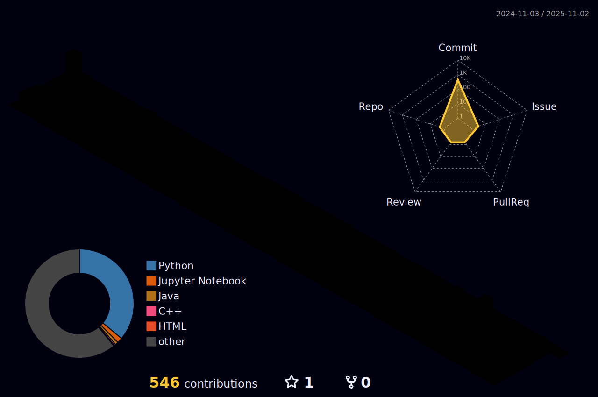

    

## 👋 Introduce

    

        👋 Hi, My name is Hyunjoon Park currently studying in the Department of Computer Software at Hanyang University. 
        🔭 I am pursuing a Master's degree at Hanyang University CVLab under the supervision of prof. Donghyeon Cho 
        🔠My research interests are 3D Vision especially 3D Human Reconstruction, 3D Gaussian Splatting and Generative Models. 

## 🎯 Contributions

